# PROJECT Design Documentation

​
> _The following template provides the headings for your Design
> Documentation.  As you edit each section make sure you remove these
> commentary 'blockquotes'; the lines that start with a > character
> and appear in the generated PDF in italics._
​

## Team Information

### Team name: Scrumblebees

* Team members
  * Ryan Webb
  * Kanisha Agrawal
  * Noah Landis
  * Priyank Patel
​

## Executive Summary

​
Introducing Sorcerer's Supply Co. (development codename), a captivating web application that transports the wonderful world of magical commerce into the digital age. Sorcerer's Supply Co. offers users a spellbinding platform to explore and acquire a wide array of magical items, from wands to brooms, and everything in between.

In its present iteration, Sorcerer's Supply Co. allows users to effortlessly create an account, peruse the diverse selection of magical items, and add desired products to their cart. Moreover, the application's owner possesses the ability to enrich the store's inventory by adding new items, as well as editing or deleting existing offerings as needed.

Built using Angular and TypeScript for the front-end, our eStore is easy to navigate and visually appealing, thanks to the Angular Material UI component library. Customers can browse through our collection of magical items effortlessly and enjoy a smooth shopping experience.

The back-end, powered by a Java Spring Boot API, takes care of essential elements like carts, users, and inventory management. This ensures a secure and reliable platform for our customers to shop with confidence.
​

### Purpose

Sorcerer's Supply Co. provides a platform for users to search and buy magic products. The most important user group for this website are people who want to buy magical items. The primary user goals for this project are to easily be able to find and purchase magic products online.

### Glossary and Acronyms

​
| Term       | Definition                                            |
|------------|-------------------------------------------------------|
| SPA        | Single Page Application                               |
| API        | Application Programming Interface                     |
| DAO        | Data Access Object                                    |
| SKU        | Stock Keeping Unit                                    |
| UI         | User Interface                                        |
| MVC        | Model-View-Controller                                 |
| MVVM       | Model-View-ViewModel                                  |
| CRUD       | Create, Read, Update, Delete                          |
| HTTP       | Hypertext Transfer Protocol                           |
| REST       | Representational State Transfer                       |
| DRY        | Don't Repeat Yourself                                 |
| admin flag | Property indicating whether a user is an admin or not |
​

## Requirements

​
This section describes the features of the application.
​
1)There should be simple authentication system for both the admin and the users.

2)Users should be able to create an account and login/logout from the website.

3)Users should be able to see a list of products in the webiste and also be able to search for the products they need.

4)Users should have full control of the items in their cart and their quantities.

5)A user's data should be saved to the inventory so that the contents of their cart persists across multiple login sessions

### Definition of MVP

​
A simple magic shop website that allows users to search, select, add to cart and order magic products that are in stock. The Owner of the website can manage the product by adding,deleting or editing the products displayed in the website.  

### MVP Features
>
> _**[Sprint 4]** Provide a list of top-level Epics and/or Stories of the MVP._

MVP Features:-

Minimal Authentication for Customer/Onwer Login & Logout

​-> Epic:- Login Session and Registeration
        -> As A user I want to be able to login/register on a seperate page/window into the estore so that my shopping cart is persistent and I can checkout my cart

        Stories include:- 
        
          1) Customer Registeration [UI] (3)
                  -> Story: As a Customer I want to be able to register for a Customer account so that I can buy Items.
                
          2) Customer Login [UI] (3)
                  -> Story: As a Customer I want to be able to log into my Customer account so that I can buy Items.

          3) Administrator Login [UI] (3)
                  -> Story: As an Administrator I want to be able to log into my Administrator account so that I can manage the website.

          4) Login User [API] (5)
                  -> Story: As a Developer I want to submit a request to login with a username so that I can create a login session for the user.
                
          5) LogOut User [API] (5)
                  -> Story:  As a Developer I want to submit a request to logout so that I can create a logout session for the user.
                
          6) Register User [API] (7)
                  -> Story: As a Developer I want to submit a request to register a new user so that the user will have an account and can log in.

          7) Get Single User [API: Controller] (2)
                  -> Story: As a Developer I want to submit a request for a single user by their username so that I can access that user’s data.          

Customer Functionality & Data Persistence

-> Epic:- Shopping cart
        -> As a Customer I want to add Items to my Shopping Cart so that I can build an order.

        Stories include:- 

            1) Add to shopping cart [UI] (3)
                  -> Story: As a Customer I want to add items to my shopping cart so that I can choose Items to purchase.

            2) Remove from shopping cart [UI] (3)
                  -> Story: As a Customer I want to remove items from my Shopping Cart so that I can choose not to purchase it.

            3) Shopping cart persistence [API: Persistence] (3)
                  -> Story: As a Customer I want my Shopping Cart to be saved to my account so that I can log in and out as I please.

-> Epic:- Browse Items
        -> As a Customer I want to browse available Items so that I can decide what to purchase.

        Stories include:-

            1) View Catalog [UI] (3)
                  -> Story: As a Customer I want to view the entire catalog so that I can choose what to purchase. 

            2) View Specific Product Details [UI] (5)
                  -> Story: As a Customer I want to view an individual item’s listing to learn more details of the item

            3) Search Items [UI] (3)
                  -> Story: As a Customer I want to use a search bar so that I can search for specific Items.

-> Story: Search for a product [API] (5)
            -> Story: As a Developer I want to submit a request to get the products in the inventory whose name contains the given text SO THAT I have access to only those products.

-> Story: Get a Single Product [API] (3)
            -> Story: As a Developer I want to submit a request to get a single product so that I can access the price and quantity.

-> Story: Get entire inventory [API] (5)
            -> Story: As a Developer I want to submit a request to get the entire inventory so that I have access to all of the products.

-> Epic:- Checkout
        -> As a Customer I want to browse available Items so that I can decide what to purchase.

        Stories include:-

            1) OrdersDAO & OrdersFileDAO [API: Persistence] (5)
                -> Story: As a Developer I want to be able to interact with Orders resources so that a customer can create, edit, and view their order.

            2) Create/Read Single Order [API: Controller] (2)
                -> Story: As a Developer I want to be able to interact with Orders resources so that a customer can create, edit, and view their order.

            3) Checkout [UI] (8)
                 -> Story: As a Customer I want to check out so that I can purchase the items in my cart.

Inventory Management

-> Epic:- Inventory Management [UI]
        -> As an Administrator I want to manage my inventory to keep my product listings up to date.

        Stories include:-

            1) Add Product to Listing [UI] (2)
                -> Story: As an Administrator I want to add new Items to the inventory so that I can expand my Item listings.

            2) Remove Product Listing [UI] (2)
                -> Story: As an Administrator I want to remove products from the inventory so that I can consolidate my Item listings.

            3) Update Product Details [UI] (2)
                -> Story: As an owner I want a button to update the product description for a products so that I can update the description of the products.

-> Story: Create new Product [API] (8)
            -> Story: AS a Developer I want to submit a request to create a new product (name, price, quantity) so that it is available to in the inventory.

-> Story: Delete a Single Product [API] (3)
            -> Story: As a Developer I WANT to submit a request to get a single product so that I can access the price and quantity.

-> Story: Update a product [API] (5)
            -> Story: As a Developer I WANT to submit a request to get the entire inventory so that I have access to all products and their details.

10% feature enchantment(s)

-> Epic:- Ratings and Reviews
        -> As a customer I want to give a product a review and a star rating.
        -> As an Administrator and a Customer, I want to delete a review for an Item.

        Stories include:-

            1) Create a Single Review [API] (5)
                -> Story: As a developer I want to submit a DELETE HTTP request to delete a single review so that I can add fulfill a user’s request to remove their review.

            2) Get all reviews for a single SKU [API] (5)
                -> Story: As a developer I want to make an HTTP GET request to the reviews resource using a SKU so that I can get all reviews that have been left for a given product.

            3) Delete a single review [API] (5)
                -> Story: As a developer I want to submit a POST HTTP request to create a single review so that I can add a user’s review for an item.

            4) View Reviews [UI] (8)
                -> Story: As a Customer I want to write a review and give a star rating so that I can share my current level of satisfaction.

            5) Delete Review [Customer] (5)
                -> Story: As a Customer I want to delete my reviews so that I have control over my voice.

            6) Delete Review [Administrator] (5)
                -> Story: As the estore owner I want to delete the reviews left by customers so I can maintain a positive environment in the estore owner.

### Enhancements

#### Review System

This feature allows users to view the reviews of a given product. Reviews connsist of a 1-5 star rating, along with an optional comment. If the user is logged in as a customer, they are able to leave one review per product. Customers are able to delete their reviews. Admins have the ability to delete any review. 

## Application Domain

This section describes the application domain.

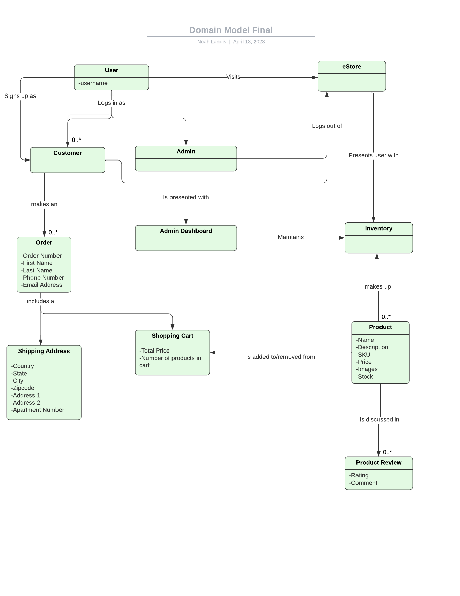

The major relationships in this are admin-dashboard-inventory, which represents the relationship between the admin and how the admin manages the inventory. Another one is customer-admin-user, which shows the heirarchy of users. We added order, wishlist, product review.

## Architecture and Design

This section describes the application architecture.

### Summary

The following Tiers/Layers model shows a high-level view of the webapp's architecture.

The e-store web application, is built using the Model–View–ViewModel (MVVM) architecture pattern. 

The Model stores the application data objects including any functionality to provide persistance. 

The View is the client-side SPA built with Angular utilizing HTML, CSS and TypeScript. The ViewModel provides RESTful APIs to the client (View) as well as any logic required to manipulate the data objects from the Model.

Both the ViewModel and Model are built using Java and Spring Framework. Details of the components within these tiers are supplied below.

### Overview of User Interface

This section describes the web interface flow; this is how the user views and interacts
with the e-store application.

As soon as a user visits our website, they are presented with the site's logo and a grid of products that we offer. To access the full range of features, users can log in or register by clicking an icon located at the top right of the header which provides users with login form.

Once on the website, users can browse our products, which are presented in a grid format. They can add items to their shopping cart by clicking the 'Add To Cart' button. They can also adjust the quantity of each item by using the round buttons within the cart listing page. If a user decides they no longer need a particular item, they can simply click on the delete icon to remove it from the cart.

Our search bar is located in the header that helps users find the exact product they're looking for.

When a user is ready to checkout with their cart, they can navigate to the cart view, then click the checkout button. In the checkout process, they will be guided through the checkout steps such as providing contact, shipping, and payment information. After reviewing their order and clicking order, they will be presented with an order confirmation which includes their order number, and a navigation link to return to the catalog.

### View Tier
>
> _**[Sprint 4]** Provide a summary of the View Tier UI of your architecture.
> Describe the types of components in the tier and describe their
> responsibilities.  This should be a narrative description, i.e. it has
> a flow or "story line" that the reader can follow._

Our view tier includes a lot of components which renders the user interface and makes the website user-friendly. The login registeration component renders the login and registeration forms to the user. The catalog component is used to render product cards that contain the product in the website. It provides a way for customers to purchase and search products. The catalog product card component displays a single product, shows the stock of the product and allows the user to add products to cart. Clicking on the catalog product card brings the user to the details for that product. The product details component renders the reviews of the products and its details.

> _**[Sprint 4]** You must  provide at least **2 sequence diagrams** as is relevant to a particular aspects 
> of the design that you are describing.  For example, in e-store you might create a 
> sequence diagram of a customer searching for an item and adding to their cart. 
> As these can span multiple tiers, be sure to include an relevant HTTP requests from the client-side to the server-side 
> to help illustrate the end-to-end flow._

One of the features in our e-store is the login system built for the customers and the admin. The following sequence diagram shows the flow of the login system.
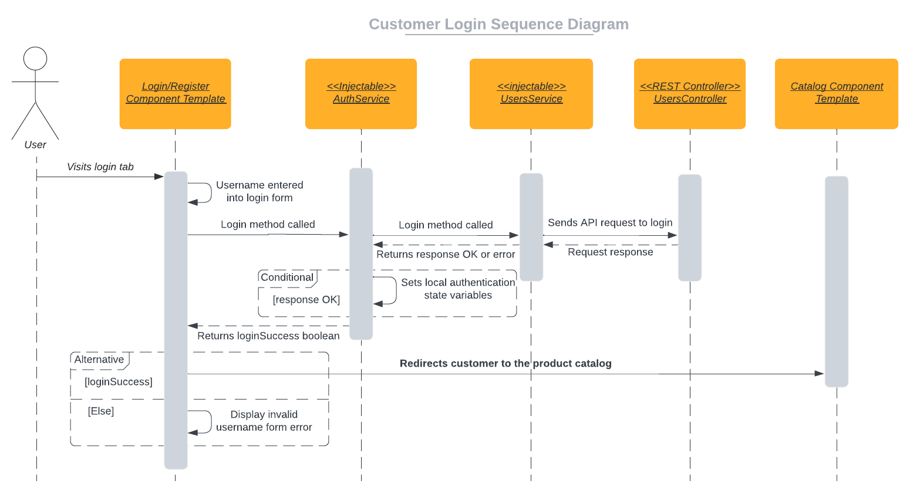

Another feature that we implemented was that the user can add products to their cart which is persistent. The following sequence diagram shows the flow of the checkout system.
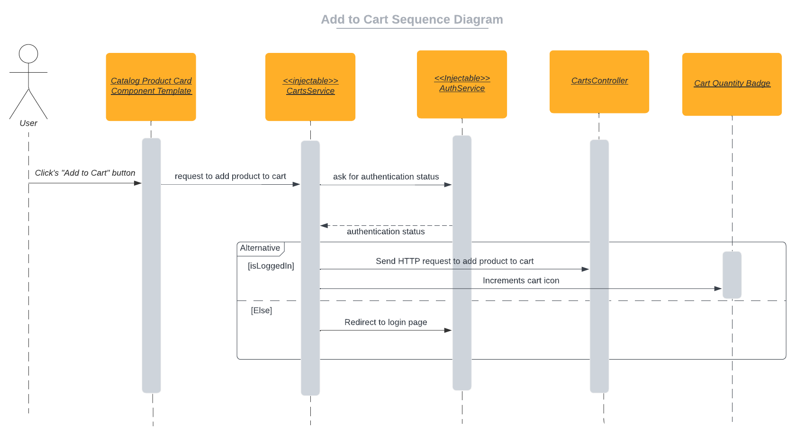

> _**[Sprint 4]** To adequately show your system, you will need to present the **class diagrams** where relevant in your design. Some additional tips:_
 >
 >* _Class diagrams only apply to the **ViewModel** and **Model** Tier_
>* _A single class diagram of the entire system will not be effective. You may start with one, but will be need to break it down into smaller sections to account for requirements of each of the Tier static models below._
 >* _Correct labeling of relationships with proper notation for the relationship type, multiplicities, and navigation information will be important._
 >* _Include other details such as attributes and method signatures that you think are needed to support the level of detail in your discussion._

### ViewModel Tier
>
> _**[Sprint 4]** Provide a summary of this tier of your architecture. This
> section will follow the same instructions that are given for the View
> Tier above._

Our ViewModel tier includes a number of services which isolate behavior involving fetching data from each of our backend API resources. These data fetching services include `UsersService`, `CartsService`, `InventoryService`, and `OrdersService`. We also have a few supporting services which do not directly call backend API endpoints, such as `AuthService`, `UpdateService`, and `MessageService`.

These services serve as a communication layer between our feature components and the backend model tier.

`AuthService` is the service that handles the login and registration of the users including the admin. It oversees the authentication of the users and the admin. It also handles the registration of the customers. It does so using the UsersService.This service is used throughout the application to render components based on the user's role. 

The `UsersService` handles the CRUD operations of the users. It is used by the AuthService to register new users and by the AdminDashboardComponent to manage the users. It makes the actual calls to the API endpoints for login, logout, register, and get user. 

The `CartsService` makes the API calls related to the carts. It makes the calls to the API endpoints for get cart, add to cart, and remove from cartremove from cart when the user is logged in as customer. It is used when a user is logged in to render components based on the user's cart.

The calls to the Inventory API are made through the `InventoryService`. These include method calls to create, update, and delete products. It also makes the calls to get all products and get a single product when a user  is logged in as admin. It is used by the catalog components of the admin and the user to manage the products.

When the customer tries to checkout, the `OrdersService` is used to make the API calls to the Orders API. It makes the calls to the API endpoints for create order, get order, and get all orders.

The `UpdateService` is used to update the data in the application. It is used to update the view of the cart, catalog and the reviews of the products when a change is made.

> _At appropriate places as part of this narrative provide **one** or more updated and **properly labeled**
> static models (UML class diagrams) with some details such as critical attributes and methods._
>
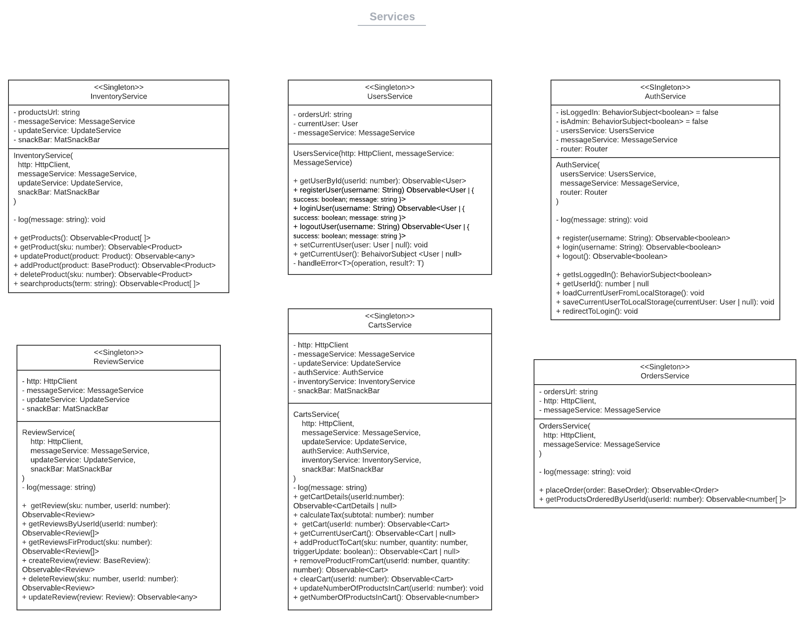

**Various components use these services to interact with the backend APIs. We developed these components in different modules to organize the structure and the code to make it easier to maintain. The following diagram shows the components that we built for each of the feature module that we created.**

**These are the components built under the admin feature module. It contains components to render the admin dashboard, catalog and to create and edit inventory items.**
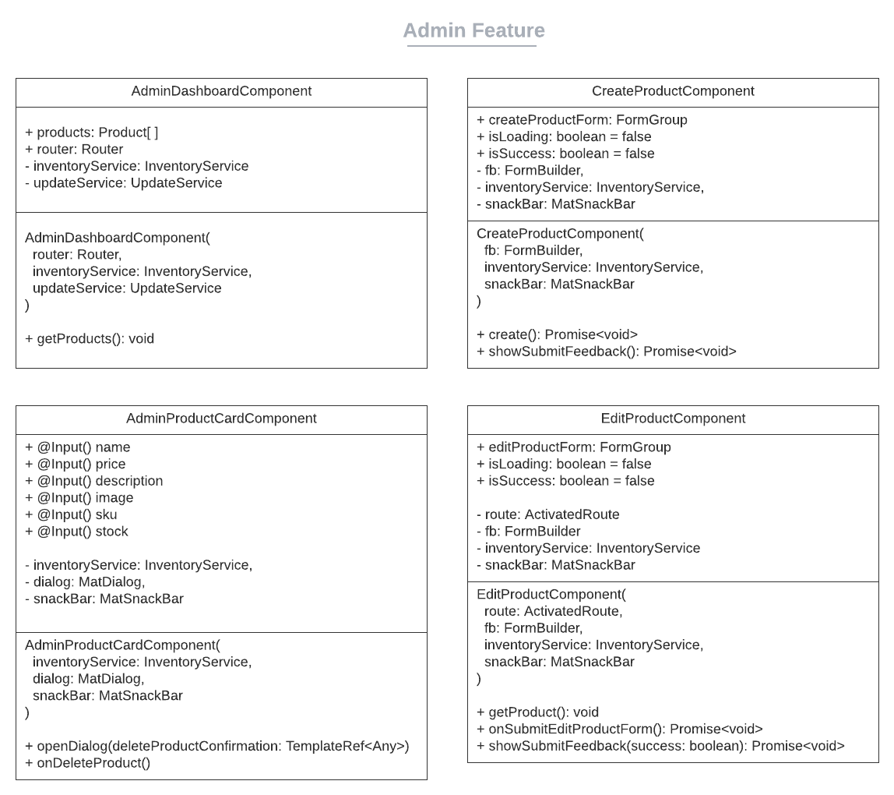

**These are the components built under the browse catalog feature module. It contains components to render the catalog and the product details to the customer.**
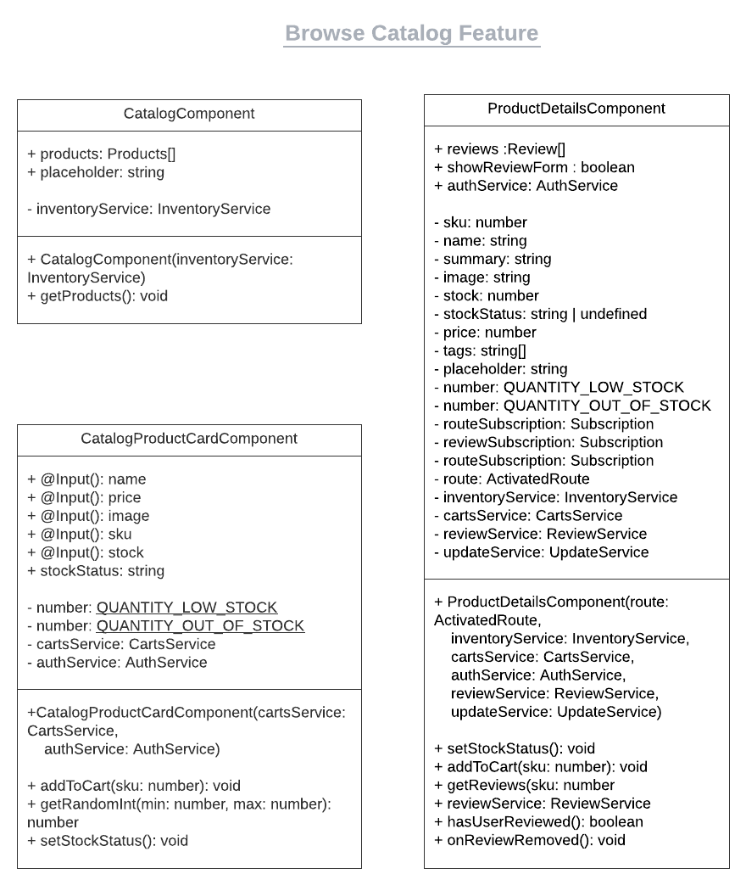

**A user is able to navigate through the different pages of the website using the navigation bar. It contains links to the home page, the catalog, the cart and the login page.**
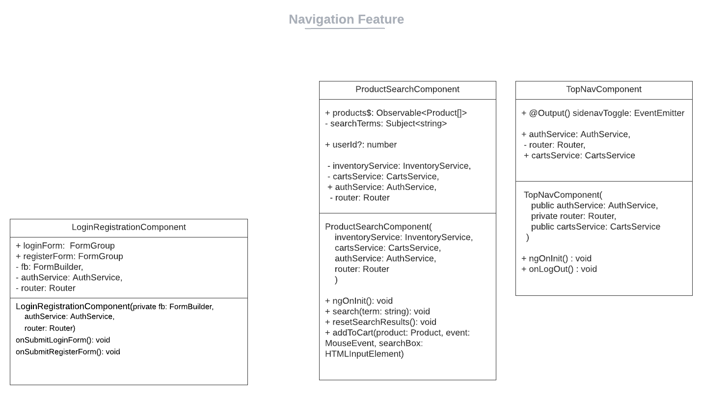

**One of the features of the website is that the customer can add products to their cart and also proceed to checkout until the order is placed. The following diagram shows the components that are used to render the cart and the checkout page.**
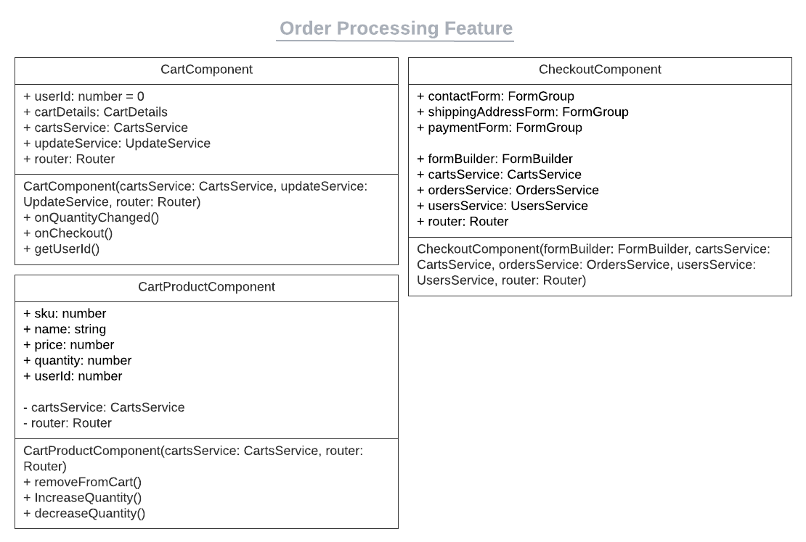

**The customers can also leave a review on a product, which was our feature enhancement. The following diagram shows the components that are used to render the review form and the reviews.**

### Model Tier

Our model tier (`M` in `MVC`) is built using Java and Spring Framework. The model tier is responsible for storing the application data objects and providing persistance. The model tier also exposes a set of APIs to the controller tier (`C` in `MVC`) to manipulate the data objects from the Model. The model tier is divided into three resources: `Inventory`, `User` and `Carts`. 

The `Inventory` resource is responsible for storing the `Product` data objects and providing persistence via Data Access Object (DAO) classes. The `Product` class is the highest abstraction class used for storing data about a product, such as name, price, SKU (Stock Keeping Unit), images, as well an instance of a `Description` object and a `Stock` object. The `Description` class is used for storing data about a product's description such as the product's summary text, the product's tags. `Description` also encapsulates behavior related to said data. The `Stock` class is used for storing the product's stock quantity, and encapsulates behavior related to it.

Persistence is provided by the `InventoryDAO` interface, and its concrete implementation `InventoryFileDAO`. The `ProductFileDAO` class is the layer between the product data objects and thee controller tier, and provides methods for saving, loading, and altering `Product` data objects. It achieves this via serialization and deserialization of `Product` objects to and from a JSON file.

The `User` resource is responsible for storing the `User` data objects and providing persistance. The primary data object stored in the `User` resource is the `User` class stores a user's ID, login state, and whether the user is an admin or not. The `User` class also encapsulates behavior related to said data.

Persistence is provided by the `UsersDAO` interface, and its concrete implementation `UsersFileDAO`. The `UsersFileDAO` class is the layer between the user data objects and thee controller tier, and provides methods for saving, loading, and altering `User` data objects. It achieves this via serialization and deserialization of `User` objects to and from a JSON file.

The `Carts` resource is responsible for storing the cart data objects. The primary data object stored in the `Carts` resource is the `Cart` class. The `Cart` class stores a user's ID, a map of SKUs to quantities in their cart, and an injected reference to the `InventoryDAO` singleton instance, which allows the class to calculate the total price of the cart, as well as check stock quantities before adding items to the cart. The `Cart` class also encapsulates behavior related to cart operations such as adding products, removing products, clearing the cart, and checking if the cart contains a product.

Persistence is provided by the `CartsDAO` interface, and its concrete implementation `CartsFileDAO`. The `CartsFileDAO` class is the layer between the cart data objects and thee controller tier, and provides methods for saving, loading, and altering `Cart` data objects. It achieves this via serialization and deserialization of `Cart` objects to and from a JSON file.
 
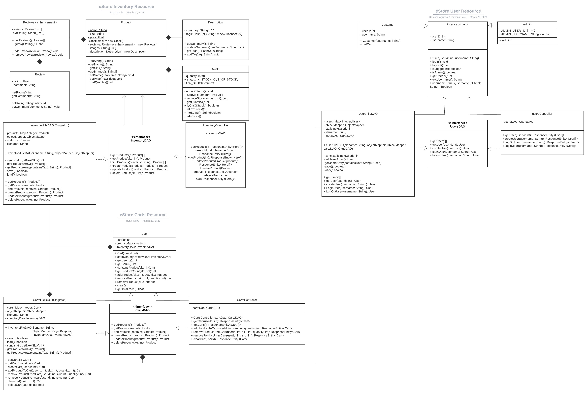
​

## OO Design Principles

### Dependency Inversion Principle (DIP)

Dependency inversion (D in SOLID) is adhered to in this project because we rely on abstraction interfaces instead of low-level concrete implementations for data storage. For data storage, we will use a Data Access Object (DAO) abstract interface, which multiple data access classes will implement. This way, at instantiation, we can directly inject the data access method we would like to use into the modules which depend only on the DAO abstraction. 
In a more complicated eStore, the dependency inversion principle could be used to create abstractions for modules handling authentication and authorization, as well as for payment handling. We could also apply dependency inversion to make a logger interface, which is injected into modules that utilize a logger. This makes implementing different types of loggers easier.

### Dependency Injection

Our application relies heavily on dependency injection in all tiers. In the controller tier, Spring Boot injects the InventoryFileDAO into the InventoryController class. This allows the InventoryController to use the InventoryFileDAO to access the data in the inventory. In the model tier, the InventoryFileDAO is injected into the Product class. This allows the Product class to use the InventoryFileDAO to access the data in the inventory. In the angular front-end, we use dependency injection for the services. We have a service for each of the REST API resources, a service for authentication, as well as a service to handle updating of components when their contents change. The services are injected into the components that need them. For example, we inject the InventoryService into components that need to fetch data from the inventory resource. This allows us to easily swap out the implementation of the service without having to change the components that use it.

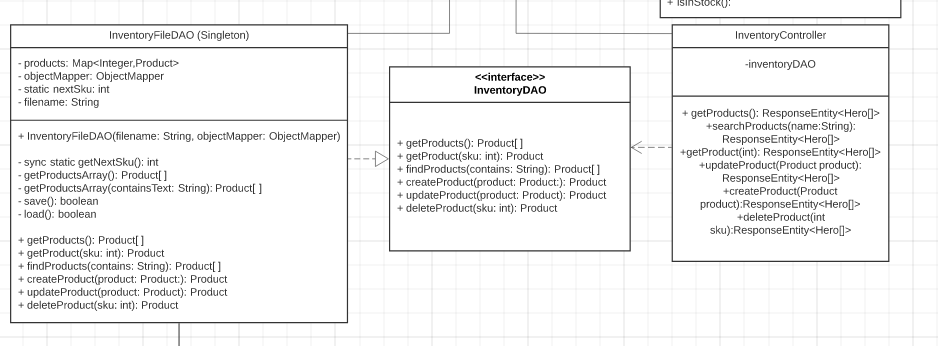

### Pure Fabrication

Creating a software system dedicated to handling data access also adheres to the pure fabrication principle of GRASP; it isn’t directly represented in the problem domain, yet its fabrication is integral to the solution architecture. Looking back at the eStore domain model, the Inventory domain entity represents the result of using a data access layer. The data access layer is not present in the model; it merely supports the behavior of the system architecture.
Another example of pure fabrication in our eStore would be a wishlist management system. The management system does not correspond to any particular entity in the problem domain and is designed purely to handle the management aspect of a wishlist.

### Single Responsibility

We have an API for the CRUD operations related to a product. In the API, this principle can be seen with the InventoryFileDAO class. This class is particularly concerned with handling the underlying data which is stored in a json file which stores the data for this API. It is not concerned with handling API requests or giving responses back to the user. That is done by InventoryController class which is more of a front for this class which makes calls to this class. This is the file that implements the InventoryDAO interface. It maintains a hashmap of all the products stored in the JSON file when initialized. Any searching is done directly from the hashmap. When a new product is to be added to the file, the hashmap is updated first and then it is overwritten on the file that stores the products. So the hashmap is basically a temporary point of storage between the user and the file.

### Law of demeter

In our Java classes, we didn’t use method chaining such as product.getStock().getQuantity(). Instead, we have a getStockQuantity() method which is accessed directly from the Product class. In doing so, we followed the law of demeter. In the case where we want to ensure enough stock quantity for a product when adding to the cart, we don't make direct calls to the Stock class, we have a method called hasEnoughStockFor() rather than making a direct call from the Cart class to the Stock class.

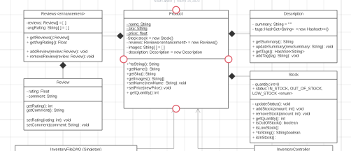

### Controller

In our backend, we have a controller tier which handles API requests from the Angular frontend (view). The controller tier is responsible for handling the requests and sending the appropriate responses back to the frontend, and represents a separation of responsibility between our View tier (the Angular frontend) and the Model tier (backend API DAO classes and supporting data model classes).

### Information Expert

In our frontend Angular code, we have a catalog component which uses product-card component inside it to display the products. This component utilizes a service called product service which can fetch the products in the inventory and display them to the frontend. The catalog component already has the service injected into it which contains the method to get the products from the inventory, i.e., the backend. This is information expert because of instead of having the seperate cards fetch the data, we have the catalog do it for the cards and then pass that value to that card component.
_
​
>_**[Sprint 3 & 4]** OO Design Principles should span across **all tiers.**_
​

## Static Code Analysis/Future Design Improvements
>
> _**[Sprint 4]** With the results from the Static Code Analysis exercise, 
> **Identify 3-4** areas within your code that have been flagged by the Static Code 
> Analysis Tool (SonarQube) and provide your analysis and recommendations.  
> Include any relevant screenshot(s) with each area._

One of the places where SonarQube flagged our code was in our fileDAO classes for each of our APIs. We were not defining a variable static which is used to keep track of the ID of the object for which the API is built. Since it is not static, it is not shared across all instances of the class. This means that if we were to create a new instance of the class, the ID would be reset to 0. It currenly is not an issue because there is only one instance of the fileDAO ever made in our application. However, if we were to create a new instance of the class, it would cause issues. To fix this, we would make the variable static.

Another place where SonarQube flagged out code was a conditional being out of place. This is an indentation issue. The conditional is not indented properly. This is a minor issue and can be fixed by simply indenting the conditional properly.

> _**[Sprint 4]** Discuss **future** refactoring and other design improvements your team would explore if the team had additional time._
​If our team had additional time, we would explore more areas where we could utilize abstraction to avoid DRY violations. For instance, our Orders,
Carts, Inventory, and Review services all currently have handleError\<T>(operation = 'operation', result?: T), with no difference in implementation between the services. Going forward, we would make this a public function that could be called by the services that require it. In keeping with the goal of adhering to DRY, we would remove two of the 'admin-flag' attributes from our Users resource. Currently, a User has three admin-flags: 'isAdmin', 'type', and 'admin'.

In addition to adhering to DRY principles, we would change how we display the stock to follow Information Expert. For example, our Stock model currently has a 'Status' enum which is used to represent a brief description of the stock quantity, to be displayed to customers (i.e, 'Low Stock' would be displayed when there are less than 10 product's in the inventory). Instead of displaying the model's status, we calculate the status on the front end in our catalog-product-card.component.ts file via setStockStatus() method. 

## Testing
>
> _This section will provide information about the testing performed
> and the results of the testing._

We tested our program using unit tests (guided by Jacoco), Postman, and visually in our UI. ​Our overall test coverage sits at 94%, with our Model Tier at 95%, our persistance tier at 95%, and our controller tier at 91%.

### Acceptance Testing

We had a total of 10 stories in the acceptance testing document, which is the total number of user stories. Out of those 10 stories, 3 of those stories didn't meet the acceptance criteria that we had come up with while doing sprint planning. The tests that failed were testing features that weren't required for the sprint 2 like adding images to product. One functional requirement that we did fail is getting the button to remove a product from the inventory working. This was a good practice to explore all the test cases that could break the code. 
​

### Unit Testing and Code Coverage
>
> _**[Sprint 4]** Discuss your unit testing strategy. Report on the code coverage
> achieved from unit testing of the code base. Discuss the team's
> coverage targets, why you selected those values, and how well your
> code coverage met your targets._
​

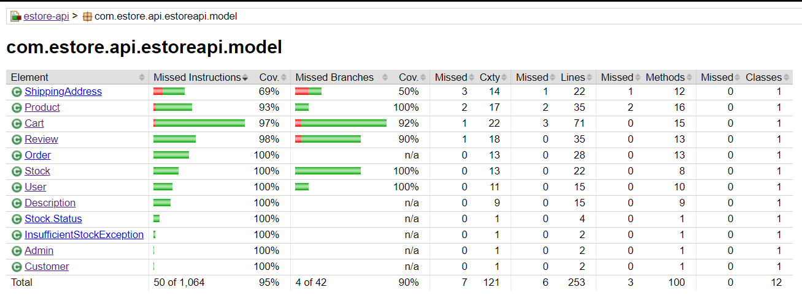

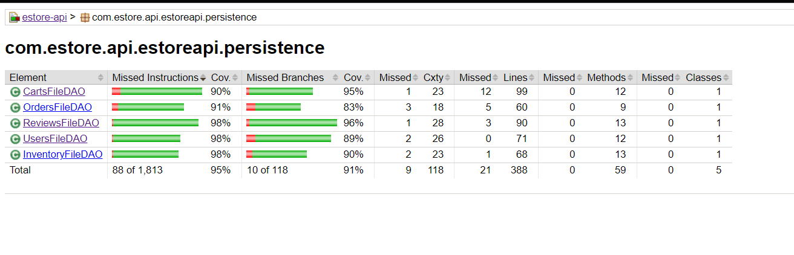

We ensured code coverage for all public methods and thus we have high code coverage. We used mockito wherever necessary. We also used PowerMockito to mock static methods. We used Jacoco to generate the code coverage reports. We used that to monitor the code coverage.
One of the reason we have such high code coverage is that we ensured to make the Unit tests part of the story definition of done as is done in the industry, so for every story we had, we would make sure to have Unit tests for whatever new Java code we wrote.
We initially targeted for 100% code coverage, but it became difficult to follow as some of the private methods were difficult to make tests for and the tests weren't reaching all the cases that we put in some methods. Moreoever, at the end of the phase, our focus shifted more on the functionality of the application than the unit test targets as we were under the pressure of the deadline. Nevertheless, overall we achieved 94% code coverage, which we feel is still great.